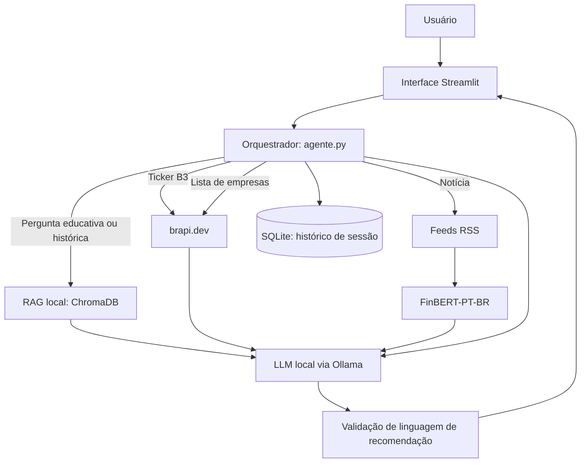

# Alessandra

Assistente financeira educacional e analítica para o mercado brasileiro. A aplicação roda localmente, responde em português e foi construída para explicar conceitos, contextualizar eventos históricos e apresentar dados disponíveis sem recomendar compra ou venda de ativos.

## O que a Alessandra faz

- Explica conceitos de finanças e investimentos em linguagem acessível.
- Consulta cotações de ativos da B3 quando a pergunta contém um ticker, como `VALE3` ou `PETR4`.
- Consulta uma lista parcial de empresas da B3.
- Resume notícias de mercado coletadas por RSS e classifica o sentimento delas.
- Usa uma base local de conhecimento com glossário financeiro e eventos históricos P0 parcialmente verificados.
- Mantém o histórico da conversa localmente em SQLite, separado por sessão.

## Limites importantes

- Não recomenda comprar, vender ou manter ativos.
- Não prevê preço futuro de ações, câmbio, índices ou outros instrumentos.
- Não faz análise de perfil de risco nem coleta patrimônio, renda, dívidas ou outros dados financeiros pessoais.
- Não executa operações financeiras.
- Não trata criptomoedas, derivativos complexos ou temas fora de finanças, economia e mercado relacionados ao escopo do projeto.
- Para eventos históricos parcialmente verificados, utiliza somente os fatos e fontes recuperados pela base local.

## Arquitetura



## Base de conhecimento

O índice RAG é local e não faz pesquisa na internet durante uma pergunta educativa. Ele contém:

| Fonte | Conteúdo | Situação |
|---|---|---|
| `data/glossario_financeiro.json` | 357 verbetes do glossário financeiro em português | Indexado |
| `data/base_historica/outputs` | 193 eventos históricos P0 parcialmente verificados, 209 claims, fontes e manifestos de auditoria | Indexada |

O script `scripts/build_index.py` valida o manifesto congelado da base P0, confere hashes dos lotes e das fontes, reinsere o overlay da crise cambial brasileira de 1999 na posição canônica e só então gera os documentos para o ChromaDB.

Na versão atual, o índice possui **550 documentos**: 357 verbetes e 193 eventos P0.

> O `README.md` não é indexado. O indexador lê o glossário e a base P0 armazenada em `data/base_historica`.

## Estrutura do projeto

```text
Assistente_Virtual_LLM/
├── data/
│   ├── glossario_financeiro.json
│   ├── base_historica/
│   │   └── outputs/
│   │       ├── database/
│   │       ├── indexes/
│   │       ├── docs/
│   │       └── guia_mestre_rag_eventos_1900_2026.md
│   └── system_prompt.txt
├── scripts/
│   ├── build_index.py
│   ├── fetch_cotacoes.py
│   ├── fetch_noticias.py
│   └── classify_sentiment.py
├── src/
│   ├── app.py
│   ├── agente.py
│   └── config.py
├── cache/                         # criado em runtime
│   ├── chroma_db/
│   ├── index_manifest.json
│   └── historico_conversa.db
├── requirements.txt
└── README.md
```

## Requisitos

- Windows com Python 3.12.
- Ollama instalado e em execução.
- Modelo local configurado em `src/config.py`.
- Base histórica incluída em `data/base_historica`.

O modelo padrão atual é `qwen2.5:7b-instruct` e o modelo de embeddings é `all-MiniLM-L6-v2`.

## Instalação

No PowerShell, dentro da pasta do projeto:

```powershell
py -3.12 -m venv .venv
.\.venv\Scripts\python.exe -m pip install --upgrade pip
.\.venv\Scripts\python.exe -m pip install -r requirements.txt
```

Baixe o modelo local uma única vez, se necessário:

```powershell
ollama pull qwen2.5:7b-instruct
```

## Construção do índice

O indexador usa `data/base_historica` por padrão. A variável `HISTORICAL_EVENTS_DIR` é opcional e só precisa ser definida para usar outra cópia compatível da base.

Para validar a base sem baixar modelos nem escrever no ChromaDB:

```powershell
.\.venv\Scripts\python.exe scripts\build_index.py --validate-only
```

Para gerar ou recriar o índice local:

```powershell
.\.venv\Scripts\python.exe scripts\build_index.py
```

O segundo comando recria somente a coleção derivada `base_conhecimento_v2` dentro de `cache/chroma_db`. Ele não altera a base de eventos histórica.

## Executar a aplicação

```powershell
.\.venv\Scripts\streamlit.exe run src\app.py
```

Exemplos de perguntas para teste:

```text
O que é renda fixa?
O que foi o Plano Real?
O que aconteceu na crise cambial brasileira de 1999?
Qual a cotação da VALE3 hoje?
```

## Segurança e confiabilidade

- Dados de cotação são obtidos pela camada de consulta e não devem ser inventados pelo modelo.
- Notícias e cotações devem ser apresentadas com fonte e horário/data disponíveis no contexto.
- A base histórica P0 distingue fatos verificados de campos que continuam incompletos.
- O prompt do sistema orienta a Alessandra a não extrapolar causalidade, impacto de mercado, custos ou efeitos no Brasil quando eles não estiverem documentados.
- O código aplica uma validação adicional para bloquear frases de recomendação direta.

## Estado atual e próximos passos

| Item | Estado |
|---|---|
| Interface conversacional local | Implementada com Streamlit |
| LLM local | Implementado via Ollama |
| Glossário financeiro | Indexado |
| Eventos históricos P0 parcialmente verificados | Indexados a partir da base congelada e auditada |
| Cotações B3 | Implementadas por API |
| Notícias e sentimento | Implementados por RSS e FinBERT-PT-BR |
| Indicadores BCB, dados CVM e GDELT | Planejados; ainda não fazem parte do fluxo atual |
| Testes automatizados | Ainda não implementados |
