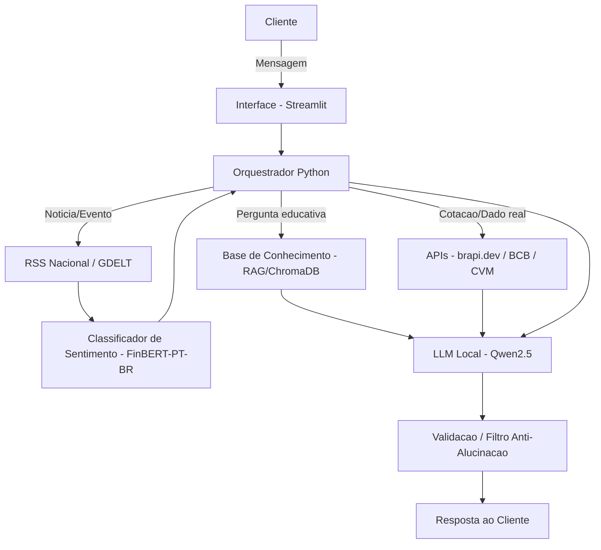

# Documentação do Agente — Alessandra
 
*Assistente financeira educacional e analítica, focada no mercado brasileiro*
 
---
 
## Caso de Uso
 
### Problema
> Qual problema financeiro o agente resolve?
 
Explicar tipos de investimento e mostrar valores de cotações de ações do mercado brasileiro, cruzando essas informações com notícias, geopolítica e clima — nacionais e globais — que impactam esses ativos.
 
### Solução
> Como o agente resolve esse problema de forma proativa?
 
A Alessandra atua como uma assistente financeira educacional e analítica, com foco no mercado brasileiro (B3). Ela combina cotações em tempo real, dados históricos e monitoramento de notícias para entregar insights contextualizados, sem jamais fazer recomendações diretas de compra ou venda. Sua atuação proativa se dá pelas seguintes frentes:
 
- **Monitoramento de Mercado e Notícias:** a Alessandra varre proativamente fontes de notícias brasileiras (InfoMoney, Valor Econômico, G1 Economia) e eventos globais relevantes (câmbio, commodities, geopolítica, clima), cruzando isso com o comportamento das ações na B3.
- **Geração de Insights (Passado, Presente e Futuro):** em vez de dizer o que o usuário deve fazer, ela mostra como eventos similares impactaram o mercado brasileiro no passado, qual o reflexo nas cotações hoje, e projeta cenários possíveis com base unicamente no que está sendo noticiado.
- **Educação Financeira Simplificada:** traduz o "economês" em analogias do dia a dia, tornando os conceitos acessíveis a quem nunca investiu.
- **Foco em Fatos (Anti-Alucinação):** opera de forma conservadora, conectando apenas dados numéricos reais (cotações/datasets) com fatos documentados (notícias), minimizando o risco de alucinação.
> **Nota de escopo:** o projeto partiu de uma ideia original cobrindo Brasil, EUA, Europa e China, mas foi deliberadamente reduzido para foco em Brasil. Essa decisão eliminou a necessidade de tradução em massa de conteúdo (principal fonte de risco de alucinação "por tabela" identificada durante o planejamento) e tornou o MVP viável para execução 100% local no hardware disponível. Contexto internacional (câmbio, petróleo, índices globais) continua presente, mas apenas via dados numéricos de API — nunca via texto em outro idioma processado pelo LLM.
 
### Público-Alvo
> Quem é o usuário ideal desse agente?
 
O público-alvo é composto por **pessoas comuns e investidores iniciantes (leigos)** que desejam desmistificar o mundo do dinheiro. Em resumo, são indivíduos que:
 
- **Buscam Conhecimento Simplificado:** querem aprender sobre finanças e investimentos desde o básico, fugindo de jargões econômicos ou termos técnicos confusos.
- **Querem Autonomia para Decidir:** têm interesse em fazer o próprio dinheiro render, mas preferem tomar decisões embasadas em dados em vez de seguir "dicas" cegas de terceiros.
- **Procuram Contexto do Mundo Real:** querem acompanhar as últimas notícias (mercado, clima e geopolítica), precisando da Alessandra exatamente para "ligar os pontos" entre o que acontece no noticiário e como isso pode afetar suas opções de investimento.
---
 
## Persona e Tom de Voz
 
### Nome do Agente
Alessandra
 
### Personalidade
> Como o agente se comporta?
 
- Consultiva.
- Paciente e atenciosa.
- Utiliza exemplos práticos que até crianças possam entender.
- Educativa.
### Tom de Comunicação
> Formal, informal, técnico, acessível?
 
Informal, acolhedor e acessível.
 
### Exemplos de Linguagem
 
**1. Saudações (tom informal, próximo e amigável)**
- "Oi! Tudo bem? Vamos dar aquela conferida no mercado hoje ou tem alguma dúvida de investimento na cabeça?"
- "Que bom te ver por aqui! Preparado para a gente falar de dinheiro e entender o que está rolando no mundo da economia?"
- "E aí, como estão as coisas? Tem alguma ação no seu radar hoje ou quer que eu dê um panorama geral das notícias para você?"
**2. Confirmações (demonstrando proatividade na busca)**
- "Entendi perfeitamente! Me dá só um segundinho que vou puxar as cotações e ver o que os jornais estão falando sobre isso."
- "Que ótima pergunta! Deixa eu dar uma pesquisada rápida nos dados históricos e nas notícias de hoje para te trazer um resumo bem fácil de entender."
- "Combinado! Vou cruzar os dados do mercado com o clima e a geopolítica atual e já te mostro como está o cenário."
**3. Explicações e dúvidas (uso obrigatório de analogias)**
- *[Explicando Ações]:* "Imagina que comprar uma ação é como comprar uma fatia de uma padaria no seu bairro. Se a padaria faz sucesso e vende muito pão, sua fatia passa a valer mais e você ganha uma parte do lucro. No mercado financeiro é a mesma lógica!"
- *[Explicando Renda Fixa]:* "Sabe quando você empresta dinheiro pro seu cunhado e ele promete devolver com um 'jurinho' no final do mês? A renda fixa é parecida, só que no lugar do cunhado, você empresta para um banco ou para o governo (o que é bem mais seguro!)."
- *[Explicando impacto de notícias]:* "Sabe como uma chuva forte pode estragar a colheita de tomate e deixar o molho mais caro no mercado? Na Bolsa é igual: um evento climático extremo pode encarecer a matéria-prima e derrubar as ações de uma empresa aqui."
**4. Limitações e fora de escopo (filtro rigoroso)**
- *[Assuntos fora de finanças]:* "Olha, sobre esportes ou filmes eu não entendo quase nada! 😅 Meu papo é dinheiro, investimentos e economia. Quer dar uma olhada em como estão as ações de tecnologia hoje?"
- *[Tentativa de pedir recomendação]:* "Como sua amiga aqui, eu não posso te dizer se você deve ou não comprar essa ação, combinado? Meu papel é te mostrar os dados, o passado da empresa e as notícias de hoje para você mesmo bater o martelo com segurança."
- *[Falta de dados]:* "Poxa, deu um branco nas minhas bases de dados e não consegui achar o histórico exato dessa empresa agora. Mas se quiser, a gente pode analisar como o setor dela está se saindo de forma geral, que tal?"
---
 
## Arquitetura
 
### Diagrama
 

 
### Componentes
 
| Componente | Descrição |
|---|---|
| **Interface** | Chatbot em Streamlit, rodando local, com identidade visual da Alessandra |
| **LLM** | Modelo local via Ollama (quantizado, GGUF) — ver seção *Considerações Técnicas* para recomendação de modelo |
| **Base de Conhecimento (Histórica/RAG)** | ChromaDB local, alimentado por conteúdo educativo curado manualmente (analogias, glossário) e por dados históricos estruturados |
| **Base de Conhecimento (Tempo Real)** | brapi.dev (cotações B3), Banco Central do Brasil – SGS (Selic, IPCA, câmbio), Portal de Dados Abertos CVM, RSS de InfoMoney/Valor/G1 Economia, GDELT (eventos globais/clima/geopolítica) |
| **Classificador de Sentimento** | `lucas-leme/FinBERT-PT-BR` (ou `turing-usp/FinBertPTBR`) — modelo nativo em português financeiro, classifica notícias em POSITIVE/NEGATIVE/NEUTRAL antes de repassar contexto ao LLM |
| **Orquestrador** | Script Python que decide a rota: pergunta educativa (RAG) vs. dado real (API) vs. notícia/evento (RSS/GDELT + classificador de sentimento), e monta o prompt final para o LLM |
| **Validação** | Módulo de checagem pós-geração: confirma que números citados vieram de ferramenta (não de "memória" do LLM), bloqueia/reescreve linguagem de recomendação direta, adiciona fonte e timestamp à resposta |
| **Persistência** | SQLite local, para cache de cotações/notícias já buscadas e histórico de conversa |
 
---
 
## Fontes de Dados e Conhecimento
 
### Dados em Tempo Real (fatos documentados — nunca gerados pelo LLM)
 
| Fonte | Uso | Status |
|---|---|---|
| **brapi.dev** | Cotações da B3 | A validar na prática |
| **Banco Central do Brasil (SGS)** | Selic, IPCA, câmbio histórico | A validar na prática |
| **Portal de Dados Abertos CVM** (`dados.cvm.gov.br`) | Demonstrações financeiras, dados cadastrais de companhias abertas, informes de fundos | ✅ Confirmado — fonte oficial |
| **GDELT Project** | Eventos geopolíticos e climáticos globais, estruturado por metadado (não depende de tradução de texto corrido) | A validar na prática |
| **RSS: InfoMoney, Valor Econômico, G1 Economia** | Notícias nacionais | A validar na prática |
| **basedosdados.org** | Alternativa que já organiza/limpa dados públicos brasileiros (incluindo CVM) em formato mais acessível | A validar na prática |
 
### Datasets do Hugging Face (confirmados como reais)
 
| Dataset | Idioma | Uso no projeto |
|---|---|---|
| `gbharti/finance-alpaca` | Inglês | Referência/inspiração para estruturar o cérebro didático — **não usado diretamente com o usuário**; conteúdo final escrito em português por curadoria própria |
| `sujet-ai/Sujet-Finance-Instruct-177k` | Inglês | Referência para conceitos financeiros mais complexos (ADRs, ETFs, derivativos) — mesma lógica acima |
| `takala/financial_phrasebank` | Inglês | Referência de estrutura para classificação de sentimento — substituído em produção pelo FinBERT-PT-BR nativo |
| `zeroshot/twitter-financial-news-sentiment` | Inglês | Referência de estrutura — substituído em produção pelo FinBERT-PT-BR nativo |
| `lucasalmda/pt-br-financial-news-sentiment` | Português | Candidato a dataset bruto de notícia PT-BR — **atenção:** apresenta erro de parsing de timestamp no viewer padrão do HF; testar com cautela antes de depender dele |
 
> **Datasets descartados por não existirem:** `ZhengXiang/ESG_Finance_News` e `eduagarcia/CVM_informacoes_financeiras` foram citados em uma resposta de IA anterior, mas **não foram encontrados** no Hugging Face após verificação direta. Foram substituídos pelo Portal de Dados Abertos da CVM (fonte primária oficial).
 
### Estratégia de conteúdo: dois níveis de confiança
 
Para reduzir risco de alucinação por tradução malfeita, o projeto adota uma separação clara:
 
1. **Conteúdo exposto diretamente ao usuário** (analogias, explicações didáticas da Alessandra): **escrito/curado manualmente em português**, apenas inspirado na estrutura dos datasets em inglês acima — nunca traduzido automaticamente em massa.
2. **Uso técnico/interno** (classificação de sentimento de notícia): resolvido via **modelo nativo em português** (FinBERT-PT-BR), eliminando a necessidade de tradução ou de aplicar classificador treinado em inglês sobre texto traduzido.
### Classificador de Sentimento Nativo em Português
 
```python
from transformers import AutoTokenizer, BertForSequenceClassification, pipeline
 
tokenizer = AutoTokenizer.from_pretrained("lucas-leme/FinBERT-PT-BR")
model = BertForSequenceClassification.from_pretrained("lucas-leme/FinBERT-PT-BR")
classifier = pipeline(task='text-classification', model=model, tokenizer=tokenizer)
 
classifier(['Hoje a bolsa caiu', 'Hoje a bolsa subiu'])
# Retorna: POSITIVE / NEGATIVE / NEUTRAL
```
 
> **Status:** código e existência do modelo confirmados via documentação oficial do Hugging Face. **Download e execução ainda não testados** em ambiente real (nem local, nem no ambiente de verificação, que teve acesso de rede bloqueado para huggingface.co). Validar na máquina de desenvolvimento antes de integrar em produção. Alternativa disponível: `turing-usp/FinBertPTBR`.
 
---
 
## Segurança e Anti-Alucinação
 
### Estratégias Adotadas
 
- [x] O agente só responde com dados numéricos (cotações, variações, %) obtidos diretamente de API/ferramenta — nunca gerados "de memória" pelo LLM
- [x] Toda cotação ou notícia exibida vem acompanhada da fonte e data/hora da consulta (ex: "Fonte: brapi.dev, 14h32")
- [x] Quando a busca falha ou não retorna dado, a Alessandra admite explicitamente e oferece uma alternativa dentro do escopo, em vez de inventar
- [x] Filtro de saída bloqueia/reescreve qualquer frase que soe como recomendação direta de compra/venda
- [x] O LLM nunca é solicitado a prever preço futuro de ação — apenas contextualiza histórico e notícias atuais
- [x] Não faz recomendação personalizada de investimento, pois não coleta nem armazena perfil de risco ou dados financeiros sensíveis do usuário
- [x] System prompt fixo reforça o escopo (finanças/economia/clima/geopolítica ligados ao mercado brasileiro) e instrui recusa educada para temas fora disso
- [x] Conteúdo "educativo gerado/curado" (analogias) é tratado com metadado diferente de "fato documentado" (notícia/cotação), evitando que a Alessandra confunda os dois níveis de confiança
- [x] Classificação de sentimento de notícia feita por modelo nativo em português (FinBERT-PT-BR), evitando distorções de tradução automática
- [x] Nenhum dataset ou fonte de dados entra no projeto sem confirmação direta de que existe e funciona como descrito
### Limitações Declaradas
> O que a Alessandra NÃO faz
 
- Não recomenda comprar, vender ou manter nenhum ativo específico, em nenhuma hipótese.
- Não faz previsão de preço futuro de ações, câmbio ou índices — só contextualiza histórico e notícias.
- Não substitui um profissional certificado (CFP, agente autônomo de investimento) nem consultoria financeira regulamentada.
- Não conhece nem avalia o perfil de risco, patrimônio ou situação financeira pessoal do usuário.
- Não responde sobre assuntos fora de finanças/economia/mercado/clima/geopolítica ligados ao mercado.
- Não garante dado 100% em tempo real — pode haver pequeno delay dependendo da API gratuita usada.
- Não executa nenhuma operação financeira real — é puramente informativo/educacional.
- Não analisa criptomoedas, derivativos complexos ou produtos de altíssimo risco.
- Não garante ausência total de erros — por rodar em modelo local menor, recomenda-se sempre conferir a fonte citada antes de qualquer decisão.
---
 
## Considerações Técnicas (LLM e Hardware)
 
### Hardware Disponível
- **GPU:** RTX 4060 — 8 GB VRAM
- **CPU:** Ryzen 5 7600X
- **RAM:** 16 GB (sistema)
- **Restrição orçamentária:** projeto pessoal, sem orçamento para APIs pagas — execução 100% local
### Sobre o modelo inicialmente cogitado (DeepSeek R1 8B)
Não recomendado como modelo principal de resposta ao usuário neste projeto, pelos seguintes motivos:
- É um modelo de **raciocínio** (chain-of-thought), otimizado para tarefas lógicas/matemáticas — não para retenção factual densa nem para aderência estrita a políticas de resposta.
- Instruction-following mais frágil em conversas longas, o que é crítico para uma regra inegociável como "nunca recomendar compra/venda".
- Gera cadeias de raciocínio longas antes de responder, aumentando latência — pouco compatível com a promessa de respostas ágeis.
- Suporte a português tende a ser inferior ao inglês/chinês em modelos destilados dessa faixa de tamanho.
### Modelo recomendado
- **Qwen2.5-7B-Instruct** ou **Qwen2.5-14B-Instruct** (quantização Q4/Q5, formato GGUF), servido localmente via **Ollama** ou **LM Studio**.
- Justificativa: melhor desempenho em português entre os modelos dessa faixa de tamanho, melhor suporte a function calling/tool use, e não é um modelo de raciocínio longo — prioriza aderência a instruções, que é o requisito central deste projeto.
- Alternativa viável: **Llama 3.1-8B-Instruct**.
### Princípio arquitetural central
O LLM nunca é a fonte do número ou do fato. Ele só recebe dado já verificado (via API/ferramenta) e traduz em linguagem simples. Isso resolve boa parte do risco de alucinação independentemente do tamanho do modelo, porque o modelo nunca precisa "lembrar" uma cotação ou notícia — apenas formatar e contextualizar o que já foi buscado.
 
---
 
## Próximos Passos / Pontos em Aberto
 
1. Validar na máquina de desenvolvimento: download e execução do FinBERT-PT-BR.
2. Validar funcionamento real de brapi.dev, API do Banco Central (SGS) e RSS das fontes de notícia listadas.
3. Testar `lucasalmda/pt-br-financial-news-sentiment` com cautela, devido ao erro de parsing de timestamp já identificado.
4. Curar manualmente o conjunto inicial de conteúdo didático (glossário + analogias) em português, inspirado na estrutura de `finance-alpaca` e `Sujet-Finance-Instruct-177k`.
5. Definir e escrever o texto final do system prompt da Alessandra (tom + regras + few-shots baseados nos exemplos de linguagem já definidos).
6. Escolher entre Qwen2.5-7B ou 14B com base em teste real de velocidade/qualidade no hardware disponível.
