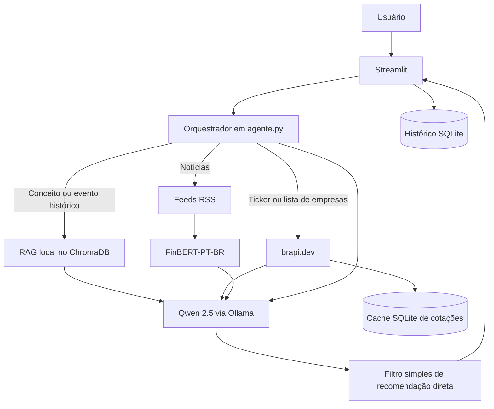

# Documentação do Agente - Alessandra

Assistente financeira educacional focada no mercado brasileiro.

## Caso de uso

### Problema

Pessoas que estão começando a estudar finanças encontram termos técnicos, notícias desconectadas e recomendações de investimento apresentadas sem contexto. Um assistente que inventa dados ou trata opinião como fato pode aumentar essa confusão.

### Solução

A Alessandra combina explicações didáticas, uma base histórica local, cotações da B3 e notícias recentes. O objetivo é ajudar o usuário a compreender conceitos e contexto, sem executar operações nem recomendar compra ou venda.

Na implementação atual, ela:

- explica termos de finanças e investimentos com apoio de um glossário local;
- recupera eventos históricos P0 parcialmente verificados;
- consulta cotações e uma lista parcial de empresas por `brapi.dev`;
- consulta notícias de InfoMoney, Valor Econômico e G1 Economia por RSS;
- classifica o sentimento dos títulos com `lucas-leme/FinBERT-PT-BR`;
- responde em português por meio do modelo local `qwen2.5:7b-instruct`, servido pelo Ollama;
- registra mensagens localmente em SQLite.

### Público-alvo

Pessoas leigas ou iniciantes que desejam aprender sobre finanças e mercado brasileiro em linguagem acessível.

## Persona e limites

A Alessandra usa um tom informal, acolhedor e educativo. Ela pode simplificar conceitos e usar analogias, mas deve preservar a diferença entre explicação didática e dado factual.

Ela não deve:

- recomendar comprar, vender ou manter um ativo;
- prever preços futuros;
- coletar ou avaliar patrimônio, renda, dívidas ou perfil de risco;
- executar operações financeiras;
- substituir orientação profissional regulamentada;
- inventar cotações, notícias, fontes ou fatos históricos.

## Arquitetura implementada

## Componentes atuais

| Componente | Implementação atual |
|---|---|
| Interface | Streamlit em `src/app.py` |
| Orquestração | Classificação de rota e montagem de contexto em `src/agente.py` |
| LLM | `qwen2.5:7b-instruct` via Ollama |
| RAG | ChromaDB, coleção `base_conhecimento_v2` |
| Embeddings | `all-MiniLM-L6-v2` |
| Glossário | 357 verbetes de `data/glossario_financeiro.json` |
| Eventos históricos | 193 eventos P0 parcialmente verificados em `data/base_historica/outputs` |
| Cotações | `brapi.dev`, com cache local de 10 minutos |
| Notícias | RSS de InfoMoney, Valor Econômico e G1 Economia, consultados sob demanda |
| Sentimento | `lucas-leme/FinBERT-PT-BR` aplicado aos títulos recuperados |
| Persistência | `cache/cotacoes_cache.db` e `cache/historico_conversa.db` |

O índice possui 550 documentos: 357 verbetes e 193 eventos históricos.

## Fluxo de uma pergunta

1. `classificar_pergunta()` escolhe entre cotação, listagem de empresas, notícia ou consulta educativa.
2. A fonte correspondente é consultada.
3. `montar_prompt()` combina o prompt fixo com o contexto do turno.
4. O Ollama gera a resposta.
5. `validar_resposta()` bloqueia algumas formulações literais de recomendação direta.
6. A interface exibe e registra a mensagem.

O filtro pós-geração é uma proteção complementar simples, não uma validação factual completa. A principal orientação de segurança continua no prompt de sistema.

## Fontes e rastreabilidade

### Implementadas

| Fonte | Uso |
|---|---|
| `brapi.dev` | Cotação e listagem parcial de ativos da B3 |
| InfoMoney RSS | Notícias recentes |
| Valor Econômico RSS | Notícias recentes |
| G1 Economia RSS | Notícias recentes |
| Base P0 local | Contexto histórico com claims e fontes institucionais |

O contexto de cotação inclui fonte, horário informado pela API e link de conferência. O contexto de notícias inclui veículo, título, data disponibilizada pelo feed, link e sentimento automático.

Se `brapi.dev` ou os feeds estiverem indisponíveis, responderem com erro ou retornarem conteúdo inválido, a aplicação apresenta um fallback e não envia dados incompletos ao modelo.

### Planejadas, ainda não implementadas

| Fonte | Uso pretendido |
|---|---|
| Banco Central do Brasil (BCB/SGS) | Selic, IPCA, câmbio e séries macroeconômicas |
| Portal de Dados Abertos da CVM | Dados cadastrais e demonstrativos regulatórios |
| GDELT | Eventos globais estruturados |

Essas três fontes não participam do fluxo atual e não devem ser apresentadas como disponíveis pela Alessandra.

## Persistência e privacidade

O banco `historico_conversa.db` registra as mensagens da sessão. A continuidade visível do chat é mantida pelo `session_state` do Streamlit; o histórico gravado não é recarregado no prompt nem usado para construir perfil financeiro.

A pasta `cache/` é criada automaticamente e não deve ser versionada.

## Limitações conhecidas

- Cotações gratuitas podem ter atraso e não equivalem ao home broker.
- A disponibilidade e o formato dos feeds RSS pertencem aos respectivos veículos.
- O sentimento é uma classificação automática do título, não uma previsão de mercado.
- Os eventos P0 são parcialmente verificados; somente claims efetivamente presentes na base devem ser usados.
- O modelo local pode errar, portanto links e fontes devem ser conferidos antes de qualquer decisão.
- Falhas do Ollama ou dos modelos locais não possuem o mesmo fallback das integrações HTTP.

## Execução

Os comandos de instalação, validação do índice e execução estão centralizados no `README.md` da raiz.

