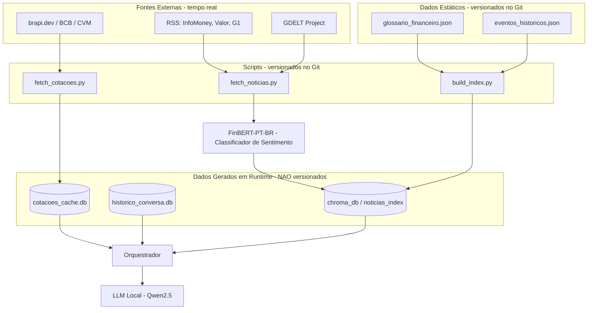
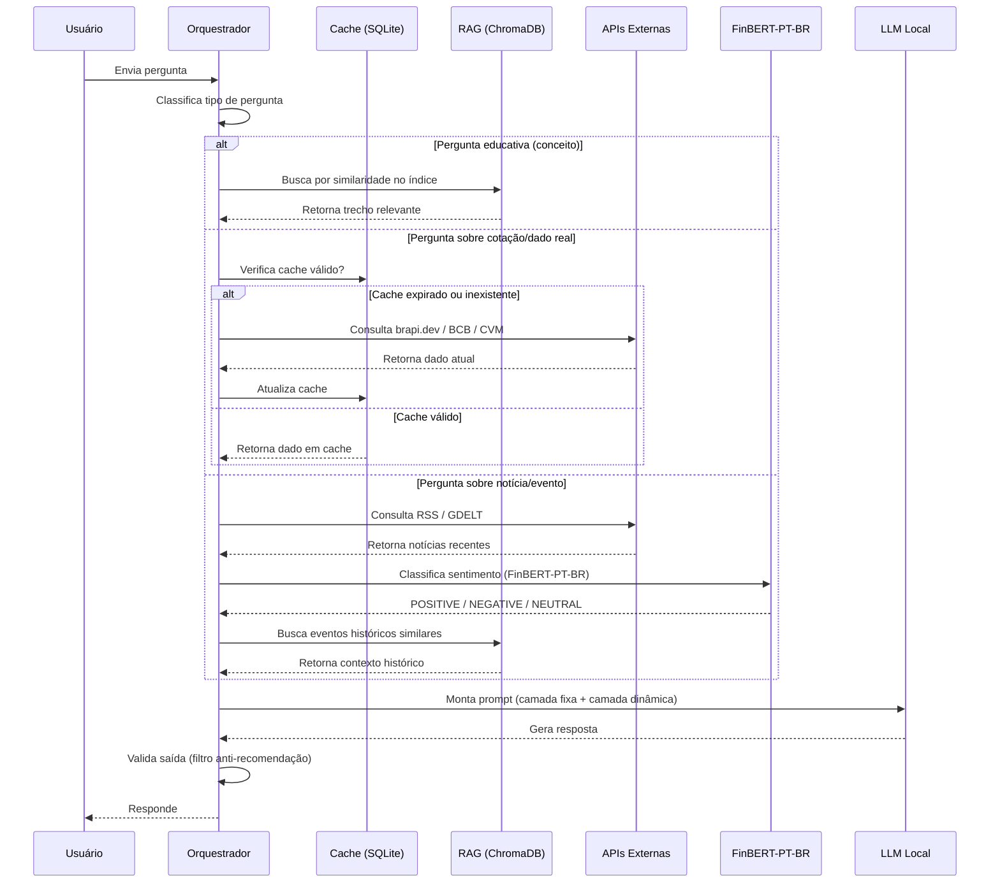

# Base de Conhecimento
 
*Arquitetura de dados do agente Alessandra — assistente financeira educacional focada no mercado brasileiro*
 
> [!IMPORTANT]
> Nenhum dado do repositório original (fork) foi reaproveitado. A base de conhecimento foi projetada do zero, pois o modelo original pressupõe um agente de atendimento personalizado (com perfil de cliente e histórico de transações), incompatível com o propósito da Alessandra: um agente **educacional e informativo**, que por design não avalia perfil de risco nem dados financeiros pessoais do usuário.
 
> [!NOTE]
> Este documento é o **detalhamento técnico** da base de conhecimento resumida no `README.md` (seções *Componentes* e *Fontes de Dados e Conhecimento*). Qualquer alteração em uma fonte de dado, script ou modelo deve ser refletida em ambos os arquivos.
 
---
 
## Visão Geral da Arquitetura de Dados
 

 
**Legenda rápida:**
- 🟢 **Estático (versionado):** arquivos que você escreve/cura manualmente — vão pro GitHub.
- 🔵 **Scripts (versionados):** código que gera os dados dinâmicos — vão pro GitHub.
- 🔴 **Runtime (não versionado):** bancos/índices criados automaticamente ao rodar o app — ficam no `.gitignore`.
- 🟡 **Externo:** fontes vivas, consultadas sob demanda, nunca armazenadas como "verdade permanente".
---
 
## Dados Utilizados
 
| Arquivo / Fonte | Formato | Origem | Utilização no Agente |
|---|---|---|---|
| `glossario_financeiro.json` | JSON | Autoral — curado manualmente por você | Explicar tipos de investimento e termos financeiros com analogias no estilo Alessandra |
| `eventos_historicos.json` | JSON | Autoral — pesquisado e documentado manualmente | Contextualizar como eventos (clima/geopolítica/economia) impactaram o mercado no passado |
| `cotacoes_cache.db` | SQLite | Gerado em runtime, a partir de APIs externas | Evitar chamadas repetidas às APIs de cotação na mesma janela de tempo |
| `noticias_index` (coleção ChromaDB) | Vetores/embeddings | Gerado em runtime, a partir dos JSONs estáticos + notícias buscadas | Recuperação por similaridade (RAG) para responder com contexto relevante |
| `historico_conversa.db` | SQLite | Gerado em runtime, por sessão de usuário | Dar continuidade à conversa — **nunca** usado para personalizar recomendação |
| `lucas-leme/FinBERT-PT-BR` (ou `turing-usp/FinBertPTBR`) | Modelo (não dataset) | Público — Hugging Face | Classifica notícias coletadas via RSS/GDELT em POSITIVE/NEGATIVE/NEUTRAL antes de indexá-las no RAG — evita depender de classificador treinado em inglês sobre texto traduzido |
| Datasets do Hugging Face (`finance-alpaca`, `Sujet-Finance-Instruct-177k`, `takala/financial_phrasebank`, `zeroshot/twitter-financial-news-sentiment`) | JSON/CSV | Público — Hugging Face | Usados apenas como referência de estrutura na curadoria do glossário e do classificador; conteúdo final é reescrito em português, nunca exposto ao usuário diretamente |
| `lucasalmda/pt-br-financial-news-sentiment` | CSV/JSON | Público — Hugging Face | Candidato a dataset bruto de notícia PT-BR para enriquecer o índice de notícias — **atenção:** erro de parsing de timestamp identificado no viewer padrão do HF; testar com cautela antes de depender dele |
 
> [!TIP]
> **Datasets públicos do Hugging Face:** foram avaliados e confirmados como existentes `gbharti/finance-alpaca`, `sujet-ai/Sujet-Finance-Instruct-177k`, `takala/financial_phrasebank` e `zeroshot/twitter-financial-news-sentiment`. Todos em inglês — usados apenas como referência estrutural, nunca traduzidos em massa (ver seção *Adaptações nos Dados*). Dois outros datasets cogitados inicialmente (`ZhengXiang/ESG_Finance_News` e `eduagarcia/CVM_informacoes_financeiras`) foram **descartados por não existirem** — substituídos pelo Portal de Dados Abertos da CVM (`dados.cvm.gov.br`), fonte oficial real.
 
---
 
## Origem Detalhada de Cada Componente
 
### 1. `glossario_financeiro.json` — autoral
 
Escrito por você, com apoio opcional de LLM para gerar rascunhos, sempre revisado antes de entrar no repositório. Estrutura de referência inspirada no formato pergunta→resposta do `finance-alpaca`, mas conteúdo 100% em português e no tom da Alessandra.
 
```json
[
  {
    "termo": "Renda Fixa",
    "definicao_simples": "Investimento em que você empresta dinheiro e sabe, desde o início, como o rendimento será calculado.",
    "analogia": "Sabe quando você empresta dinheiro pro seu cunhado e ele promete devolver com um jurinho no final do mês? A renda fixa é parecida, só que no lugar do cunhado, você empresta para um banco ou para o governo.",
    "tipo": "educativo_gerado"
  }
]
```
 
### 2. `eventos_historicos.json` — autoral, pesquisado
 
Casos reais e documentados (ex: safra e clima, variação cambial, crises setoriais) pesquisados em fontes confiáveis e resumidos por você em formato estruturado. Não é gerado automaticamente — é trabalho de curadoria.
 
```json
[
  {
    "evento": "Seca no Sul do Brasil - 2021",
    "resumo": "Estiagem afetou a safra de soja e milho, pressionando exportações do agronegócio.",
    "impacto_mercado": "Ações de empresas do setor agro e de logística de commodities recuaram no curto prazo.",
    "fonte": "descrição da fonte usada na pesquisa",
    "tipo": "fato_documentado"
  }
]
```
 
### 3. `cotacoes_cache.db` — gerado em runtime
 
Não existe até o app rodar. Criado por `fetch_cotacoes.py` na primeira consulta a brapi.dev/BCB/CVM, com timestamp para controle de expiração do cache.
 
### 4. `noticias_index` (ChromaDB) — gerado em runtime
 
Criado ao rodar `build_index.py`, que transforma o glossário, os eventos históricos e as notícias coletadas em embeddings (via `all-MiniLM-L6-v2`) para permitir busca por similaridade.
 
### 5. `historico_conversa.db` — gerado em runtime
 
Criado automaticamente pelo SQLite na primeira mensagem de cada sessão de chat. Guarda apenas o histórico do diálogo atual — nunca perfil ou dado financeiro pessoal do usuário.
 
### 6. "Histórico de notícias" (RSS + GDELT) — busca ao vivo, sem arquivo fixo
 
Não é um dataset salvo permanentemente. `fetch_noticias.py` consulta RSS (InfoMoney, Valor Econômico, G1 Economia) e GDELT em tempo real, a cada necessidade — o que fica salvo é só o cache temporário de curto prazo, não um repositório histórico de notícias.
 
### 7. `FinBERT-PT-BR` — modelo público, nativo em português
 
Não é um dado, é um **modelo classificador** (`lucas-leme/FinBERT-PT-BR`, alternativa `turing-usp/FinBertPTBR`), baixado do Hugging Face e rodado localmente via `transformers`. Toda notícia coletada por `fetch_noticias.py` passa por ele antes de ser indexada no ChromaDB, recebendo um rótulo de sentimento (POSITIVE/NEGATIVE/NEUTRAL) que entra como metadado no `noticias_index`.
 
```python
from transformers import AutoTokenizer, BertForSequenceClassification, pipeline
 
tokenizer = AutoTokenizer.from_pretrained("lucas-leme/FinBERT-PT-BR")
model = BertForSequenceClassification.from_pretrained("lucas-leme/FinBERT-PT-BR")
classifier = pipeline(task='text-classification', model=model, tokenizer=tokenizer)
```
 
> **Status:** existência e uso confirmados via documentação oficial do Hugging Face — download e execução ainda não testados em ambiente real. Validar na máquina de desenvolvimento antes de integrar em produção (ver `README.md`, seção *Fontes de Dados e Conhecimento*).
 
---
 
## Adaptações nos Dados
 
Não houve "adaptação" dos dados mockados do repositório original — houve **substituição total**. Motivos:
 
1. **Incompatibilidade de propósito:** o template original pressupõe um agente que conhece o cliente (`perfil_investidor.json`), analisa transações (`transacoes.csv`) e sugere produtos por perfil. A Alessandra, por regra declarada de anti-alucinação e anti-recomendação, não avalia perfil de risco nem dado financeiro pessoal — usar essa base contradiria a limitação já documentada do agente.
2. **Redução de superfície de risco:** ao não armazenar nem simular dados sensíveis (saldo, transações, perfil de investidor), o agente elimina uma categoria inteira de risco de privacidade, mesmo em ambiente de teste/mock.
3. **Dados reais no lugar de mockados:** cotações e notícias vêm de fontes reais (APIs públicas), e o conteúdo educacional é curado manualmente — priorizando precisão sobre volume, mesmo que isso signifique uma base menor no início.
| Arquivo original (fork) | Destino |
|---|---|
| `historico_atendimento.csv` | Substituído por `historico_conversa.db` (gerado em runtime, sem análise de perfil) |
| `perfil_investidor.json` | ❌ Descartado — contradiz a limitação declarada do agente |
| `produtos_financeiros.json` | Substituído por `glossario_financeiro.json` (explica o produto, não "sugere o ideal para você") |
| `transacoes.csv` | ❌ Descartado — fora do escopo do agente |
 
---
 
## Estratégia de Integração
 
### Como os dados são carregados?
 

 
Dois ritmos de carregamento distintos:
 
- **Dados estáticos** (`glossario_financeiro.json`, `eventos_historicos.json`, datasets HF de referência): processados **uma única vez**, em etapa offline de indexação (`build_index.py`), gerando o índice vetorial no ChromaDB. Não são recarregados a cada sessão.
- **Dados dinâmicos** (cotação, notícia do dia): buscados **sob demanda**, apenas quando a pergunta do usuário exige, com cache em SQLite para evitar chamadas repetidas à mesma fonte na mesma janela de tempo.
### Como os dados são usados no prompt?
 
Não vão "todos" no system prompt — isso estouraria o contexto rapidamente em um modelo local menor. O prompt final é montado em duas camadas:
 
| Camada | Conteúdo | Frequência |
|---|---|---|
| **Fixa (system prompt)** | Persona da Alessandra, regras de conduta, tom, limitações declaradas | Sempre presente, pequena, não muda por pergunta |
| **Dinâmica (por turno)** | Resultado da consulta de API (cotação/notícia) + trecho recuperado do RAG relevante à pergunta específica | Injetada a cada nova pergunta, varia conforme o conteúdo |
 
Cada trecho injetado carrega um metadado de confiança (`tipo: "fato_documentado"` ou `tipo: "educativo_gerado"`), permitindo que o filtro de validação saiba diferenciar dado verificado de conteúdo didático gerado.
 
---
 
## Exemplo de Contexto Montado
 
```
[SYSTEM PROMPT — camada fixa]
Você é a Alessandra, assistente financeira educacional focada no mercado brasileiro.
Regras: nunca recomende compra/venda; sempre cite a fonte e a data/hora do dado;
se não souber, admita e redirecione dentro do escopo; use analogias simples.
 
[CONTEXTO DINÂMICO — injetado nesta pergunta]
Pergunta do usuário: "Por que a ação da Vale caiu hoje?"
 
Dado de mercado (fonte: brapi.dev, consultado às 14:32):
- VALE3: R$ 61,20 (-3,8% no dia)
 
Notícia relevante (fonte: G1 Economia, hoje):
- Queda no preço do minério de ferro após dados fracos da manufatura chinesa
- Sentimento classificado: NEGATIVE (FinBERT-PT-BR)
 
Contexto histórico (RAG — eventos_historicos.json, tipo: fato_documentado):
- "Em quedas similares de demanda chinesa por minério (2015, 2021),
   mineradoras brasileiras recuaram entre 3% e 8% no curto prazo."
 
[Instrução final]: Responda usando apenas os dados acima, no tom da Alessandra,
sem recomendar compra ou venda.
```
 
---
 
## Estrutura de Repositório Sugerida
 
```
projeto-alessandra/
├── data/
│   ├── glossario_financeiro.json      # versionado — autoral
│   └── eventos_historicos.json        # versionado — autoral
├── scripts/
│   ├── build_index.py                 # versionado — gera o ChromaDB local
│   ├── fetch_cotacoes.py              # versionado — consulta brapi.dev/BCB/CVM
│   ├── fetch_noticias.py              # versionado — consulta RSS/GDELT
│   └── classify_sentiment.py          # versionado — chama o FinBERT-PT-BR
├── cache/                             # NÃO versionado (.gitignore)
│   ├── cotacoes_cache.db
│   ├── historico_conversa.db
│   └── chroma_db/
├── models/                            # NÃO versionado (.gitignore)
│   └── finbert-pt-br/                 # baixado do Hugging Face na 1ª execução
└── .gitignore
```
 
```gitignore
cache/
*.db
chroma_db/
models/
__pycache__/
```
 
> [!NOTE]
> Essa estrutura garante que qualquer pessoa que clone o repositório encontre apenas o **conteúdo autoral** (`data/`) e o **código que gera o restante** (`scripts/`) — nenhum dado sensível, pesado ou binário fica versionado no Git.
