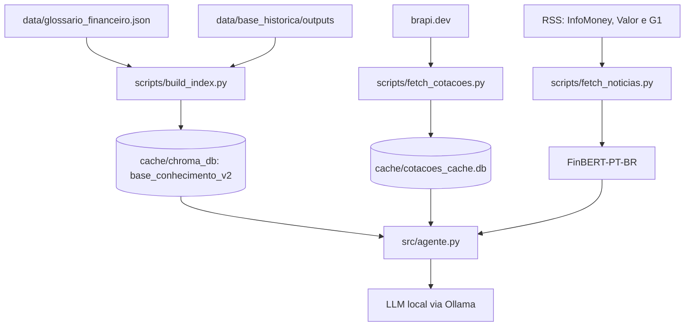

# Base de Conhecimento

Arquitetura de dados implementada na Alessandra.

## Visão geral

A base combina dois conjuntos versionados e fontes externas consultadas somente quando a pergunta exige:

- um glossário financeiro local com 357 verbetes;
- uma base histórica local com 193 eventos P0 parcialmente verificados;
- cotações e listagem de ativos da B3 por `brapi.dev`;
- notícias recentes por três feeds RSS.

BCB, CVM e GDELT são extensões planejadas e não fazem parte da implementação atual.



## Dados versionados

| Caminho | Conteúdo | Uso |
|---|---|---|
| `data/glossario_financeiro.json` | 357 verbetes em português | Explicações educativas e conceituais |
| `data/base_historica/outputs` | Lotes P0, overlay de reparo, fontes e manifestos | Contexto histórico auditável |
| `data/system_prompt.txt` | Persona, limites e regras da Alessandra | Camada fixa de toda chamada ao LLM |

### Glossário

O indexador lê a lista `verbetes`, valida a presença do termo e transforma campos relevantes em um documento textual. Cada item recebe metadados como:

```json
{
  "tipo": "glossario",
  "categoria": "glossario",
  "termo": "Nome do termo",
  "capitulo": "Nome do capitulo"
}
```

### Eventos históricos P0

A base histórica não é um único `eventos_historicos.json`. Ela é composta por arquivos JSONL em `data/base_historica/outputs/database`, acompanhados por fontes e manifestos em `data/base_historica/outputs/indexes`.

Antes de indexar, `scripts/build_index.py`:

1. localiza `p0_canonical_frozen_manifest.json`;
2. exige certificação e autorização de uso downstream;
3. confere hashes dos 64 lotes de eventos e fontes;
4. valida o overlay de reparo do evento cambial brasileiro de 1999;
5. reconstrói a ordem canônica de 193 IDs;
6. associa os claims às fontes existentes;
7. gera um documento por evento.

O congelamento e a integridade da cadeia são certificados, mas os registros têm cobertura factual parcial. Por isso, a descrição correta é **193 eventos parcialmente verificados**.

## Índice vetorial

| Propriedade | Valor atual |
|---|---|
| Banco vetorial | ChromaDB persistente |
| Diretório | `cache/chroma_db` |
| Coleção | `base_conhecimento_v2` |
| Modelo de embeddings | `all-MiniLM-L6-v2` |
| Verbetes | 357 |
| Eventos P0 | 193 |
| Total | 550 documentos |

O comando de indexação recria apenas a coleção derivada. Os arquivos em `data/` não são alterados.

Por padrão, o indexador usa `data/base_historica`. A variável `HISTORICAL_EVENTS_DIR` permanece disponível apenas para apontar uma cópia alternativa compatível.

## Dados gerados em runtime

| Caminho | Criação | Conteúdo |
|---|---|---|
| `cache/chroma_db` | `scripts/build_index.py` | Índice vetorial derivado |
| `cache/index_manifest.json` | `scripts/build_index.py` | Resumo da indexação |
| `cache/cotacoes_cache.db` | `scripts/fetch_cotacoes.py` | Cotações com validade de 10 minutos |
| `cache/historico_conversa.db` | `src/app.py` | Mensagens registradas por sessão |

A pasta `cache/` é criada automaticamente. Ela e os arquivos SQLite permanecem fora do Git.

## Dados externos atuais

### Cotações e empresas

`scripts/fetch_cotacoes.py` consulta:

- `https://brapi.dev/api/quote/{ticker}` para cotações;
- `https://brapi.dev/api/quote/list` para uma lista parcial de empresas.

A camada valida status HTTP, JSON, estrutura da resposta e campos numéricos obrigatórios. Falhas de rede, timeout, HTTP ou resposta inválida resultam em fallback, sem inventar valores.

### Notícias

`scripts/fetch_noticias.py` consulta sob demanda:

- InfoMoney;
- Valor Econômico;
- G1 Economia.

As notícias não são gravadas no ChromaDB e não possuem cache SQLite. Cada feed é isolado: uma fonte indisponível não impede o uso das demais. Cada item válido carrega fonte, título, resumo, link e data publicada pelo feed.

Em `src/agente.py`, até cinco títulos recebem classificação de sentimento pelo `FinBERT-PT-BR` e entram diretamente no contexto do turno. O rótulo é informativo e não representa recomendação ou previsão.

## Recuperação e montagem de contexto

Perguntas educativas ou históricas recuperam até quatro documentos da coleção. O contexto enviado ao LLM identifica se cada trecho veio do glossário ou da base histórica.

Perguntas de cotação recebem preço, variação, fonte, horário e link de conferência. Perguntas de notícias recebem veículo, título, data, link e sentimento.

Os 550 documentos não são enviados de uma vez. Somente os resultados pertinentes ao turno entram no prompt, reduzindo consumo de contexto.

## Persistência da conversa

`src/app.py` registra cada mensagem em `historico_conversa.db`. A interface usa `st.session_state` para exibir o histórico da sessão aberta. O banco não é consultado pelo agente e não é usado como memória entre sessões nem para criar perfil do usuário.

## Fontes planejadas

| Fonte | Situação |
|---|---|
| Banco Central do Brasil (BCB/SGS) | Planejada; sem integração no código atual |
| Portal de Dados Abertos da CVM | Planejada; sem integração no código atual |
| GDELT | Planejada; sem integração no código atual |

Nenhum exemplo ou resposta deve afirmar que essas fontes foram consultadas até que suas integrações sejam implementadas.

## Estrutura relevante

```text
Assistente_Virtual_LLM/
├── data/
│   ├── base_historica/
│   │   └── outputs/
│   ├── glossario_financeiro.json
│   └── system_prompt.txt
├── scripts/
│   ├── build_index.py
│   ├── fetch_cotacoes.py
│   ├── fetch_noticias.py
│   └── classify_sentiment.py
├── src/
│   ├── agente.py
│   ├── app.py
│   └── config.py
├── cache/                  # criado automaticamente e ignorado pelo Git
├── requirements.txt
└── README.md
```

